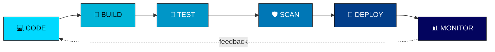

<div align="center">

<!--
  ====================== BANNER PLACEHOLDER ======================
  Ganti baris  di bawah ini dengan link banner AI kamu setelah
  digenerate (upload ke repo lalu ganti src, atau host di imgur/etc).
-->


</div>

<details>
<summary>🎨 Prompt Banner AI (klik untuk lihat) — pakai di Bing Image Creator / Midjourney</summary>

```
A futuristic dark-themed 3D holographic dashboard, neon sky-blue and cyan
accent lighting, ultra-wide cinematic composition. On the left side, an
interactive CI/CD pipeline flow diagram made of glowing connected nodes
reading "CODE -> BUILD -> TEST -> SCAN -> DEPLOY", each stage represented
as a floating hologram module. On the right side, a dynamic monitoring and
observability data wall showing animated metric graphs and waveform charts
resembling Grafana, Loki and Tempo dashboards, with flowing data streams
and glowing line charts. AWS, Docker, Kubernetes, and Grafana logos are
seamlessly embedded inside the network nodes of the pipeline diagram,
glowing softly as part of the architecture rather than randomly placed
icons. At the top center, bold futuristic sci-fi typography reads
"ALVIN SATRIA GANZA" with a smaller subtitle below it: "DEVOPS &
OBSERVABILITY ENGINEER". Background is a deep dark navy/black server room
blurred with bokeh lights, digital grid lines, and subtle circuit-like
particle connections. Ultra-detailed, high-tech, cinematic lighting,
8k render, professional tech branding style.
```

</details>

<div align="center">

# 👋 Hai, Saya Alvin Satria Ganza

### 🚀 DevOps Enthusiast | Cloud & Infrastructure Automation | Observability

</div>

---

## 📌 Tentang Saya

```
🎓 Mahasiswa Teknik Komputer — Politeknik Negeri Padang
🔭 Sedang mendalami dunia DevOps, Cloud Engineering & System Administration
🌱 Fokus belajar: CI/CD Pipeline, Container Orchestration, dan Observability Stack
🛠️ Suka membangun infrastruktur yang otomatis, aman, dan mudah diskalakan
💬 Tertarik diskusi seputar: DevOps, Cloud Native, Networking & Monitoring
📫 Terbuka untuk kolaborasi project & internship di bidang DevOps/Cloud
```

Saya adalah mahasiswa Teknik Komputer yang bersemangat menjelajahi dunia **DevOps** dan **Cloud Engineering**. Ketertarikan saya berfokus pada bagaimana membangun *pipeline* otomatis yang efisien, mengelola infrastruktur sebagai kode (*Infrastructure as Code*), serta memastikan sistem berjalan andal melalui *monitoring* dan *observability* yang baik. Saya percaya bahwa otomatisasi dan kolaborasi yang solid antara *development* dan *operations* adalah kunci untuk membangun software yang scalable dan reliable.

---

## 🧰 Tech Stack & Tools yang Sedang Saya Pelajari

<div align="center">

### 🖥️ Operating Systems


### ☁️ Cloud & Infrastructure as Code


### 📦 Containers & Orchestration


### 🔁 CI/CD & Version Control


### 🧩 Backend Framework


### 📊 Monitoring & Observability


### 📋 Project Management


</div>

---

## 💻 Programming & Scripting

<div align="center">


</div>

---

## 🔄 Alur Kerja DevOps Saya

<div align="center">



</div>

---

## 📊 GitHub Stats

<div align="center">


<br/>


<br/>


</div>

---

## 🌐 Connect with Me

<div align="center">

<a href="https://www.linkedin.com/in/alvin-satria-ghaza-65388a337/" target="_blank">

</a>
<a href="[https://www.instagram.com/alvinsatriaghaza?stkn=MWFhdmh1NHIwMHZ4MA==]" target="_blank">

</a>
<a href="https://github.com/alvin895" target="_blank">

</a>
<a href="mailto:[alvinsatriaghaza@gmail.com]" target="_blank">

</a>

</div>

---

<div align="center">

### ⚡ "Automate everything, deliver faster."


</div>
