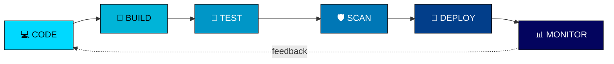

<div align="center">

# Hey Everyone 👋, I'm Alvin Satria Ganza

### DevOps Enthusiast · Cloud & Infrastructure Automation · Observability

<a href="https://github.com/alvin895">
  
</a>
<a href="https://www.linkedin.com/in/alvin-satria-ghaza-65388a337/">
  
</a>
<a href="https://www.instagram.com/alvinsatriaghaza">
  
</a>

<br><br>


</div>

---

<div align="center">
  <!--
    Ganti src di bawah dengan link banner AI kamu setelah digenerate
    (upload ke repo ini, misalnya sebagai Banner1.png, lalu pakai
    format raw.githubusercontent.com seperti contoh di bawah).
  -->
  
</div>

<details>
<summary>🎨 Prompt Banner AI (klik untuk lihat) — pakai di Bing Image Creator / Midjourney</summary>

```
A futuristic dark-themed 3D holographic dashboard, neon sky-blue and cyan
accent lighting, ultra-wide cinematic composition. On the left side, an
interactive CI/CD pipeline flow diagram made of glowing connected nodes
reading "CODE -> BUILD -> TEST -> SCAN -> DEPLOY", each stage represented
as a floating hologram module. On the right side, a dynamic monitoring and
observability data wall showing animated metric graphs and waveform charts
resembling Grafana, Loki and Tempo dashboards, with flowing data streams
and glowing line charts. AWS, Docker, Kubernetes, and Grafana logos are
seamlessly embedded inside the network nodes of the pipeline diagram,
glowing softly as part of the architecture rather than randomly placed
icons. At the top center, bold futuristic sci-fi typography reads
"ALVIN SATRIA GANZA" with a smaller subtitle below it: "DEVOPS &
OBSERVABILITY ENGINEER". Background is a deep dark navy/black server room
blurred with bokeh lights, digital grid lines, and subtle circuit-like
particle connections. Ultra-detailed, high-tech, cinematic lighting,
8k render, professional tech branding style.
```

</details>

---

## 👨‍💻 About Me

<p>
  
  
  
</p>

<p>
  
  
</p>

Saya adalah mahasiswa **Teknik Komputer di Politeknik Negeri Padang** yang bersemangat menjelajahi dunia **DevOps** dan **Cloud Engineering**. Ketertarikan saya berfokus pada bagaimana membangun *pipeline* otomatis yang efisien, mengelola infrastruktur sebagai kode (*Infrastructure as Code*), serta memastikan sistem berjalan andal melalui *monitoring* dan *observability* yang baik. Saya percaya otomatisasi dan kolaborasi yang solid antara *development* dan *operations* adalah kunci membangun software yang scalable dan reliable.

### Currently Learning

<p>
  
  
  
  
  
  
</p>

- 👨‍💻 Projects: [github.com/alvin895](https://github.com/alvin895)
- 💬 Ask me about **DevOps, Cloud Engineering, System Administration, CI/CD & Networking**
- 🎓 Kampus: Politeknik Negeri Padang — Teknik Komputer
- 📫 Terbuka untuk kolaborasi project & internship di bidang DevOps/Cloud

---

## `$ ls technologies/`

### Cloud, DevOps and Infrastructure

<p align="left">
  
</p>

### Development

<p align="left">
  
</p>

### Observability & Project Management

<p align="left">
  
</p>

### DevOps Ecosystem Lengkap

<p align="left">
  
  
  
  
  
  
  
</p>

---

## `$ devops --focus`

Topik yang sedang saya pelajari dan dalami secara serius:

```text
├── Linux and Shell Scripting (Red Hat & Ubuntu)
├── Git, GitHub and GitLab
├── GitHub Actions CI/CD Pipeline
├── Docker and Containerization
├── Kubernetes Orchestration
├── Terraform and Ansible (Infrastructure as Code)
├── AWS Cloud Fundamentals
├── Nginx and Networking
├── Spring Boot Backend Development
└── Monitoring & Observability: Prometheus, Grafana, Loki, Tempo, OpenTelemetry
```

---

## 🔄 Alur Kerja DevOps

<div align="center">



</div>

---

## `$ github --profile-summary`

<p align="center">
  
  
  
</p>

<div align="center">


</div>

## `$ git streak`

<p align="center">
  
</p>

## `$ git log --graph --all`

<p align="center">
  
</p>

---

## 🤝 Open to Collaborations

<p>
  
  
  
</p>

- 🤝 Kolaborasi project DevOps/Cloud
- 🎓 Study group & sharing knowledge seputar DevOps
- 💼 Terbuka untuk kesempatan internship di bidang DevOps/Cloud Engineering
- 🧭 Senang berdiskusi dan belajar bareng

---

## `$ connect --with-me`

<p align="center">
  <a href="https://www.linkedin.com/in/alvin-satria-ghaza-65388a337/">
    
  </a>
  <a href="https://www.instagram.com/alvinsatriaghaza">
    
  </a>
  <a href="https://github.com/alvin895">
    
  </a>
  <a href="mailto:alvinsatriaghaza@gmail.com">
    
  </a>
</p>

---

<div align="center">

### ⚡ "Automate everything, deliver faster."

```text
Build • Automate • Deploy • Scale
```

**⭐ Follow [alvin895](https://github.com/alvin895) untuk update perjalanan belajar DevOps saya**

</div>
